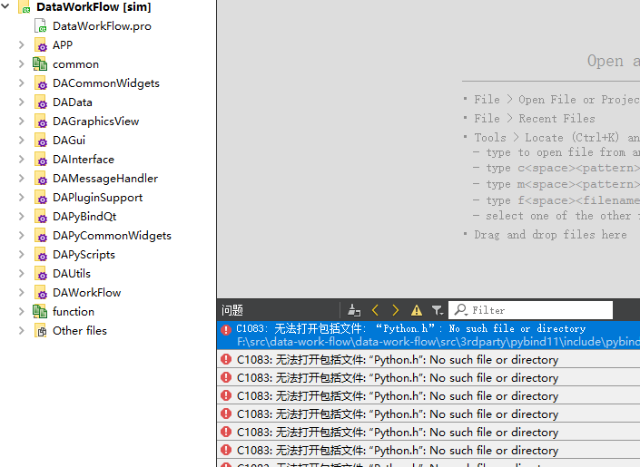
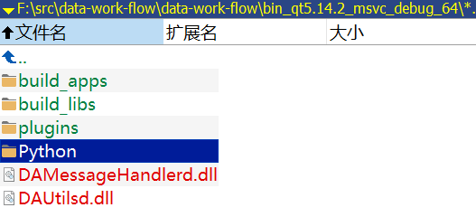
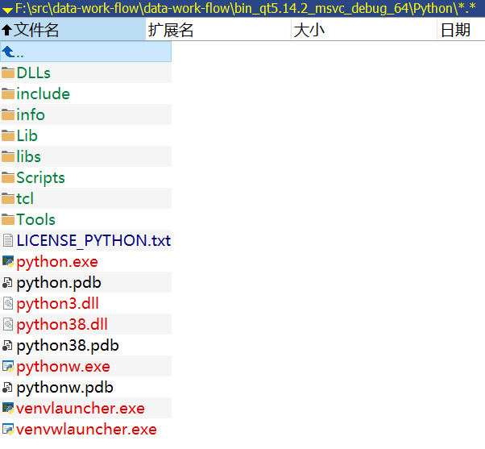
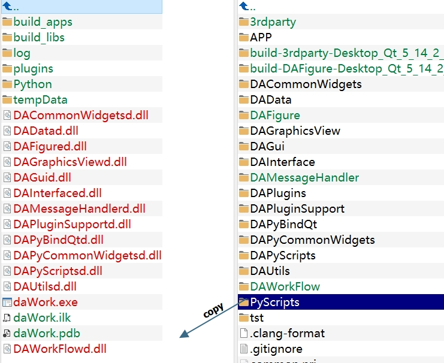

# 简介

数据工作流设计器，这个软件的设计目标是实现工作流驱动数据的ETL，集成panda的数据处理能力，实现高效的交互式数据可视化以及能固定输出论文级别的图片，软件主要分三大块：work flow、data、chart，三大板块的关系如下图所示：


软件的设计初衷：

在数据处理过程往往有很多重复性的工作，尤其针对科研实验数据，有可能要面对n组数据，每组数据的清洗抽取方式基本是一样的，因此我希望一个数据处理软件应该是带有工作流功能的，当然python是很容易实现上述功能，但要求有一定的开发基础且要熟悉一些库才能得心应手

另外通过python进行数据处理过程，很多功能是隐藏的，panda有那么多种数据清洗方法，除非你把整个文档浏览一遍，否则你很难想起他们，因此一个交互式的数据清洗工具是很有必要的，把功能通过GUI明确的展现给用户，这样数据处理过程不需要长时间的翻阅文档

最后也是我用matlab和python这类数据处理工具最头疼的一点，就是数据可视化，虽然matlab和python能做出很漂亮的图，但细微的调节非常令人抓狂，例如要调整一个文本的位置，交互式的设计你只需要拖动一下鼠标，但在脚本语言里你要指定它的坐标，如果图片非常大，渲染时间比较久，那么移动一个文本到你想要的地方是一件令人非常抓狂的事情，而且matlab或者matplotlib的数据可视化函数有多有细，每次操作都要查阅半天文档，这是另人非常苦恼的事情。

本软件的设计就是为了解决上面遇到的这三个问题，因此软件会分为三大板块：工作流解决固定流程问题，数据处理板块会把pandas的功能进行集成，chart板块能实现交互式的数据可视化，且能生成论文级别的图片

软件界面截图：

更新于2022年9月

# 编译

编译前请确保已经拉取了第三方库，由于使用的是`git submodule`方式管理大部分第三方库，因此需要执行：

```shell
git submodule update --init --recursive
```

把所有第三方库拉取

## bin目录

DA项目编译好的二进制文件统一生成到bin_qt$$[QT_VERSION]_{msvc/mingw}_{debug/release}{/_64}目录下，如：使用qt5.14.2, msvc版本debug模式64位编译，将生成`bin_qt5.14.2_msvc_debug_64`文件夹，[common.pri](./src/common.pri)文件定义了DA项目的目录内容:

```shell
# DA_BIN_DIR为生成的bin文件夹 ./bin_qt$$[QT_VERSION]_{msvc/mingw}_{debug/release}{/_64}
# DA_SRC_DIR为源代码路径：./src
DA_3RD_PARTY_DIR = $${DA_SRC_DIR}/3rdparty # 第三方库路径
BIN_APP_BUILD_DIR = $${DA_BIN_DIR}/build_apps # 生成的app路径
BIN_LIB_BUILD_DIR = $${DA_BIN_DIR}/build_libs # 生成的lib路径
BIN_TEST_BUILD_DIR = $${DA_BIN_DIR}/build_tst # 生成的测试程序路径
BIN_PLUGIN_BUILD_DIR = $${DA_BIN_DIR}/build_plugins # 生成的plugin路径
BIN_PLUGIN_DIR = $${DA_BIN_DIR}/plugins #插件的路径
BIN_TEST_DIR = $${DA_BIN_DIR}/tst #测试程序路径
```

bin_xx目录下的build_libs将是构建的库所在目录，也是第三方库需要放置的目录，下面先讲如何编译第三方库

## 第三方库编译

首先需要编译第三方库，第三方库位于`src/3rdparty`, 第三方库使用`git submodule`形式进行管理，因此第三方库需要在根目录下（存在`.gitmodules`的目录）执行下面语句对第三方库进行拉取

```shell
git submodule update --init --recursive
```

用Qt Creator 打开`src/3rdparty/3rdparty.pro`对第三方库进行编译

编译完第三方库后，需要手动把第三方库编译的结果（`.a/.lib`文件）移动到`bin_xx/build_libs`文件夹下，把编译的`*.dll`文件移动到`bin_xx`目录下

qwt和Qt-Advanced-Docking-System的编译结果是在build文件夹下，SARibbon会在本程序目录下建立一个bin_xx目录，在查找生成的lib时需要注意，ctk会自动把生成的dll和lib转移到对应的文件夹，无需手动移动

需要编译的第三方库如下：

### SARibbon

用qt creator 打开`./src/3rdparty/SARibbon/SARibbon.pro`进行编译

编译完成后会把`./src/3rdparty/SARibbon/bin_xx`目录下的`*.lib / *.a`文件拷贝到`bin_xx`目录下的`build_libs`文件夹下，把`dll`文件拷贝到`bin_xx`目录下

### Qt-Advanced-Docking-System

用qt creator 打开`./src/3rdparty/Qt-Advanced-Docking-System/ads.pro`进行编译

编译完成后的二进制文件会在`./src/build-3rdparty-Desktop_Qtxx`下的`Qt-Advanced-Docking-System`里，用户根据自己定义的情况查找，找到其lib文件夹下的lib文件和dll文件复制到`build_libs`文件夹和`bin_xx`目录下

### ctk

> 本程序使用的ctk是简化版ctk，仅抽取了使用到的几个类，因此称为liteCtk

用qt creator 打开`./src/3rdparty/ctk/ctk.pro`进行编译

此库已经自动配置编译lib和dll的位置，无需手动移动

### qwt

在build目录下找到qwt编译好的dll和lib文件，把lib文件拷贝到`bin_xx`目录下的`build_libs`文件夹下，把`dll`文件拷贝到`bin_xx`目录下

## python环境配置

DA依赖python环境：

- 至少是python3.7
- python环境需要安装pandas库

把安装好pandas库的python环境整体拷贝到`bin_xx`目录下，并重命名为`Python`，DA默认的python搜索路径就是程序运行目录下的`Python`文件夹，另外需要把`./src/PyScripts`文件夹拷贝到`bin_xx`目录下，这是DA的固定脚本内容

如果遇到如下错误，说明你缺少Python环境设置的环节，请确保已经配置好Python环境



你要保证`bin_xx`目录下有Python环境，如下图所示


Python目录内部如下图所示


如果用其他版本的Python，也需要配置[./src/python_lib.pri](./src/python_lib.pri)文件

把DA_PYTHON设置为对应的python版本：


如python3.7则设置为：

```shell
DA_PYTHON = python37
```

## 编译程序

用Qt Creator 打开`./src/DataWorkFlow.pro`进行编译，编译过程会自动把文件编译到`bin_xx`目录下

## python脚本准备

`da-work-flow`的许多功能是通过python实现的，程序运行需要`data-work-flow/src/PyScripts`下的脚本支持，需要把`PyScripts`拷贝到bin_xx目录下



# 程序框架及说明

[1.插件与接口](./doc/zh/插件与接口.md)

[2.可缩放图元模块](./doc/zh/可缩放图元.md)

[3.工作流模块](./doc/zh/工作流.md)

# 程序截图